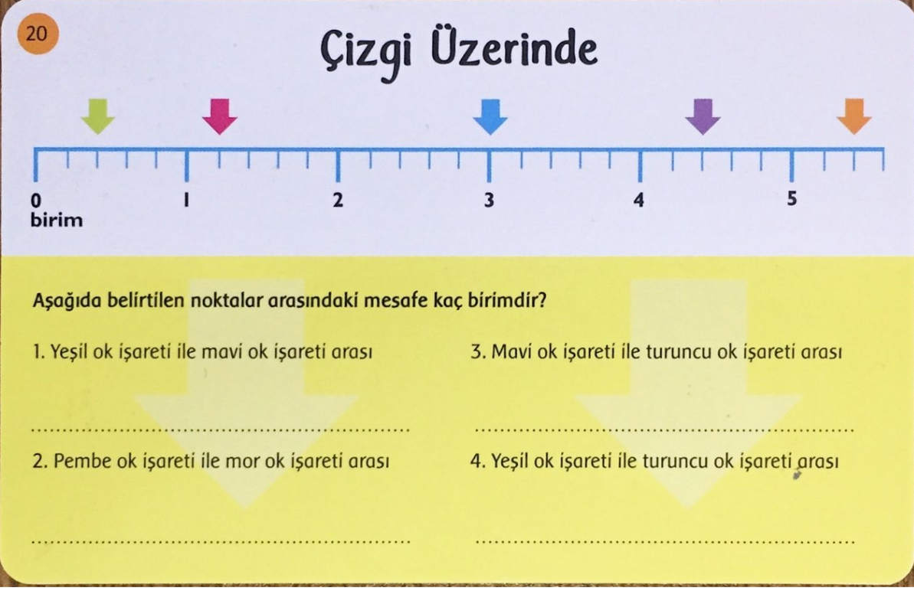
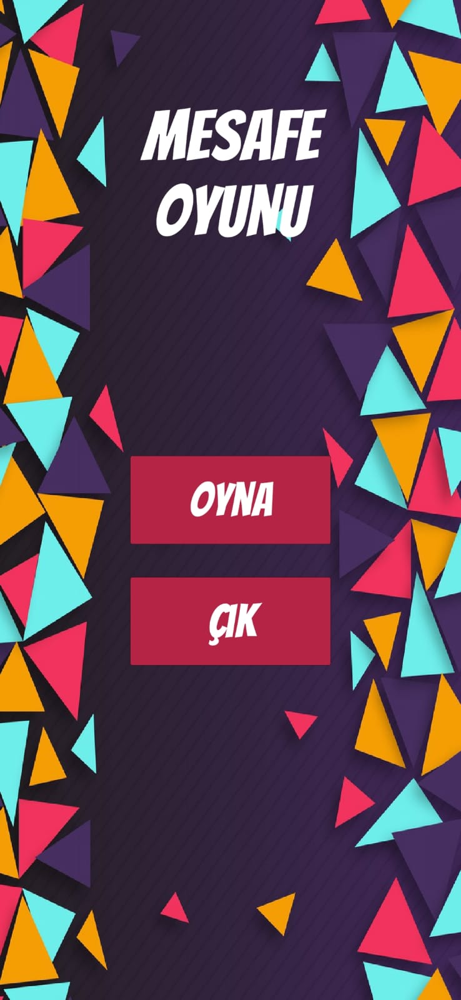
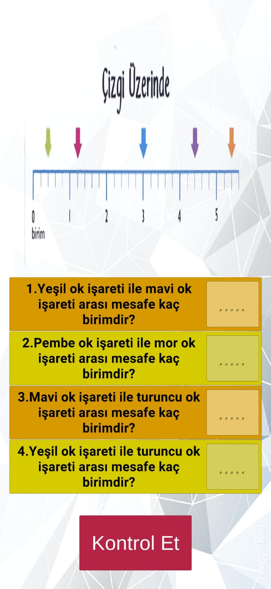
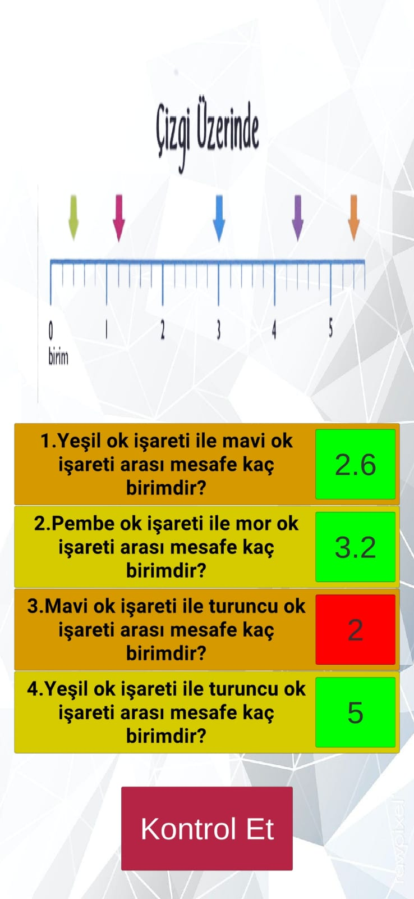
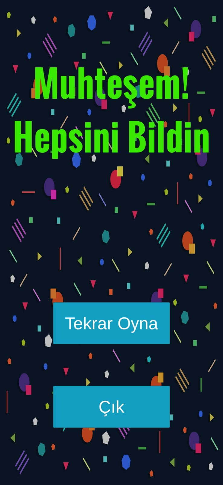

# Mesafeyi Bul

Bu proje, Samet Can Söylemez tarafından Fırat Üniversitesi Yazılım Mühendisliği Güncel Konular dersi finali için geliştirilen bir proje mobil oyunudur. Oyunun adı 'Mesafeyi Bul' olarak belirlenmiştir ve 'Mobil' platformda çalışmaktadır.

## Kullandığım Programlar ve Diller

* Unity
* Visual Studio 2019
* C#

## Proje Konusu Olan Kart

 

## Oyunun Amacı
* İç içe geçmiş şekillere göre verilen soruları cevaplama
* Cevapları doğrulayabilme
* Cevapları kontrol etme

## Oyunun Özellikleri
* Görsel zeka geliştirme
* Okuduğunu anlayabilme
* Sade tasarım
* Hitap edilen kitleye uygunluk
* Kullanım kolaylığı

## Dökümanlar
[Oyun içi anlatımdan kod analizine kadar tüm dökümanlara buradan erişebilirsiniz.](Dokumantasyon)

## Apk Dosyası
[Kart oyunu Apk dosyasına buradan erişebilirsiniz.](KartOyunuApk.zip)
## Oyun İçi Görseller
 
 
 
